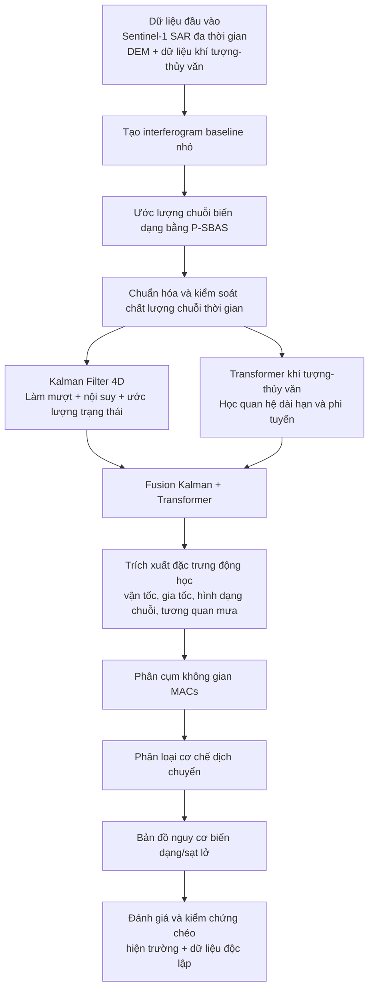

# InSAR Ground Deformation Monitoring
## Tĩnh Túc, Nguyên Bình, Cao Bằng, Việt Nam

Pipeline giám sát biến dạng mặt đất bằng InSAR đa thời gian.
Kết hợp P-SBAS (Festa et al. 2022) và Fusion 4D Kalman+Transformer (Zheng et al. 2026).

## Cơ sở lý thuyết

### 1) InSAR và dịch chuyển theo phương nhìn vệ tinh (LOS)

**Nguyên lý đo pha giao thoa:**
InSAR (Interferometric Synthetic Aperture Radar) đo chênh lệch pha giữa hai ảnh radar phức (Single Look Complex – SLC) thu nhận cùng khu vực ở hai thời điểm $t_1$ và $t_2$. Pha giao thoa tổng quát được phân rã thành:

$$\phi_\text{int} = \phi_\text{topo} + \phi_\text{disp} + \phi_\text{atm} + \phi_\text{orb} + \phi_n$$

| Thành phần | Ký hiệu | Nguồn gốc |
|---|---|---|
| Địa hình | $\phi_\text{topo}$ | Độ cao địa hình, loại bỏ bằng DEM ngoại sinh |
| Dịch chuyển LOS | $\phi_\text{disp}$ | Biến dạng bề mặt thực sự |
| Khí quyển | $\phi_\text{atm}$ | Độ trễ pha khô/ướt tầng đối lưu, tầng điện ly |
| Quỹ đạo | $\phi_\text{orb}$ | Sai số xác định quỹ đạo vệ tinh |
| Nhiễu | $\phi_n$ | Nhiễu nhiệt, thay đổi tán xạ bề mặt |

**Chuyển đổi pha → dịch chuyển LOS:**
Sau khi trừ pha địa hình và hiệu chỉnh quỹ đạo, dịch chuyển theo phương LOS được tính:

$$d_\text{LOS} = -\frac{\lambda}{4\pi} \cdot \phi_\text{disp}$$

trong đó $\lambda$ là bước sóng radar (Sentinel-1 C-band: $\lambda \approx 5.6\,\text{cm}$). Dấu âm theo quy ước: dịch chuyển ra xa vệ tinh cho pha dương.

**Hình học quan sát và phân tích 3D:**
Dịch chuyển LOS là hình chiếu của vector dịch chuyển 3D $(d_U, d_E, d_N)$ lên phương nhìn:

$$d_\text{LOS} = d_U \cos\theta - d_E \sin\theta \cos\alpha + d_N \sin\theta \sin\alpha$$

trong đó $\theta$ là góc tới ($\approx 34°$ cho Sentinel-1 IW) và $\alpha$ là góc phương vị của hướng nhìn.

---

### 2) Chuỗi thời gian đa ảnh và P-SBAS

**Mạng interferogram baseline nhỏ (SBAS):**
Thay vì dùng cặp ảnh đơn lẻ, SBAS (Small BAseline Subset) chọn tập interferogram thỏa mãn ngưỡng baseline không gian $B_\perp < B_{\perp,\text{max}}$ (thường 150–200 m) và baseline thời gian $B_t < B_{t,\text{max}}$ (thường 60–120 ngày) để giảm thiểu mất tương quan.

**Bài toán chuỗi thời gian:**
Với $M$ interferogram từ $N$ ảnh SAR tại các thời điểm $t_1 < t_2 < \ldots < t_N$, mỗi interferogram $(i,j)$ đóng góp phương trình:

$$\phi_{i,j}(x,y) = \phi_j(x,y) - \phi_i(x,y)$$

Hệ phương trình này dạng ma trận $\mathbf{A}\,\vec{v} = \vec{\phi}$ với $\mathbf{A}$ là ma trận thiết kế (design matrix) kết nối vận tốc trung bình các cung thời gian:

$$v_k = \frac{\phi(t_{k+1}) - \phi(t_k)}{t_{k+1} - t_k}, \quad k = 1, \ldots, N-1$$

Hệ có thể suy biến do mạng interferogram gián đoạn → giải bằng **bình phương tối thiểu tổng quát** (WLSQ) hoặc **SVD** với ràng buộc tốc độ nhỏ nhất (minimum norm).

**P-SBAS (Pixel-SBAS – Festa et al. 2022):**
Mở rộng SBAS bằng cách xử lý ở cấp độ pixel phân tán (Distributed Scatterers – DS):
- Áp dụng lọc thích nghi (Goldstein filter) trên từng interferogram.
- Kiểm tra tính nhất quán pha bằng **Temporal Coherence** $\gamma_t$:

$$\gamma_t = \frac{1}{M}\left|\sum_{j=1}^{M} e^{i(\phi_j^\text{obs} - \phi_j^\text{model})}\right|$$

- Chỉ giữ pixel với $\gamma_t > \gamma_\text{thresh}$ (thường 0.7–0.8).
- Áp dụng **spatial-temporal unwrapping** thích nghi để đảm bảo tính liên tục pha.
- Kết quả: trường vận tốc biến dạng trung bình $\bar{v}(x,y)$ và chuỗi dịch chuyển $d(x,y,t_k)$ có độ tin cậy cao hơn SBAS cổ điển với pixel ổn định.

---

### 3) Lọc trạng thái không-thời gian bằng Kalman 4D

**Mô hình trạng thái động học:**
Biến dạng mặt đất được biểu diễn như trạng thái vector $\mathbf{x}_k$ tại bước thời gian $k$:

$$\mathbf{x}_k = \begin{bmatrix} d_k \\ v_k \\ a_k \end{bmatrix} \in \mathbb{R}^3$$

trong đó $d_k$, $v_k$, $a_k$ lần lượt là dịch chuyển, vận tốc và gia tốc.

**Phương trình hệ thống (State Transition):**

$$\mathbf{x}_{k+1} = \mathbf{F}\,\mathbf{x}_k + \mathbf{w}_k, \quad \mathbf{w}_k \sim \mathcal{N}(\mathbf{0},\,\mathbf{Q})$$

$$\mathbf{F} = \begin{bmatrix} 1 & \Delta t & \frac{\Delta t^2}{2} \\ 0 & 1 & \Delta t \\ 0 & 0 & 1 \end{bmatrix}$$

**Phương trình quan sát (Measurement):**

$$\mathbf{z}_k = \mathbf{H}\,\mathbf{x}_k + \mathbf{v}_k, \quad \mathbf{v}_k \sim \mathcal{N}(\mathbf{0},\,\mathbf{R})$$

với $\mathbf{H} = [1\;0\;0]$ (chỉ quan sát dịch chuyển) và $\mathbf{R}$ phản ánh variance nhiễu InSAR.

**Chiều thứ 4 – không gian:**
Không gian được tích hợp thông qua ma trận hiệp phương sai quá trình $\mathbf{Q}$ phụ thuộc khoảng cách, thực hiện làm mượt không gian đồng thời với lọc thời gian. Mô hình Gauss-Markov bậc 1 trong không gian:

$$C(r) = \sigma^2 \exp\!\left(-\frac{r}{L_c}\right)$$

trong đó $L_c$ là chiều dài tương quan không gian ($\approx 500\,\text{m}$ với vùng mỏ Tĩnh Túc).

**Hai bước Kalman:**
- **Dự báo (Predict):** $\hat{\mathbf{x}}_{k|k-1} = \mathbf{F}\hat{\mathbf{x}}_{k-1|k-1}$, $\mathbf{P}_{k|k-1} = \mathbf{F}\mathbf{P}_{k-1|k-1}\mathbf{F}^\top + \mathbf{Q}$
- **Cập nhật (Update):** $\mathbf{K}_k = \mathbf{P}_{k|k-1}\mathbf{H}^\top(\mathbf{H}\mathbf{P}_{k|k-1}\mathbf{H}^\top + \mathbf{R})^{-1}$; $\hat{\mathbf{x}}_{k|k} = \hat{\mathbf{x}}_{k|k-1} + \mathbf{K}_k(\mathbf{z}_k - \mathbf{H}\hat{\mathbf{x}}_{k|k-1})$

Tại bước thời gian thiếu dữ liệu (không có ảnh SAR), bộ lọc chỉ thực hiện bước dự báo → cho phép **nội suy** chuỗi thời gian liên tục.

---

### 4) Fusion với Transformer khí tượng-thủy văn

**Cơ chế tác động ngoại sinh:**
Biến dạng đất ở vùng khai thác – sườn dốc chịu ảnh hưởng bởi:
- **Mưa tích lũy** → tăng áp lực lỗ rỗng → giảm sức kháng cắt.
- **Mực nước ngầm** → thay đổi ứng suất hiệu quả → lún/trương.
- **Độ ẩm đất bề mặt** → trương nở đất sét và đá phong hóa.
- **Nhiệt độ** → co giãn nhiệt theo mùa của nền đất.

**Kiến trúc Transformer:**
Mô hình multi-head self-attention học quan hệ dài hạn trong chuỗi thời gian lai:

$$\mathbf{X}_\text{in}(t) = [\underbrace{d_\text{Kalman}(t)}_\text{InSAR đã lọc},\; \underbrace{P(t),\; SM(t),\; GWL(t),\; T(t)}_\text{biến khí tượng-thủy văn}]$$

Attention weight $A_{ij}$ định lượng mức độ bước thời gian $j$ ảnh hưởng đến dự báo tại $i$:

$$A = \text{softmax}\!\left(\frac{\mathbf{Q}\mathbf{K}^\top}{\sqrt{d_k}}\right)\mathbf{V}$$

**Chiến lược Fusion Kalman + Transformer:**
Không thay thế Kalman bằng Transformer mà **kết hợp bổ trợ**:
- Kalman cung cấp **chuỗi nền vật lý** $\hat{d}_\text{Kalman}(t)$ (state estimate).
- Transformer dự báo **phần dư phi tuyến** $\Delta d_\text{hydro}(t)$ do tác động ngoại sinh.
- Kết quả tổng hợp: $d_\text{fused}(t) = \hat{d}_\text{Kalman}(t) + \Delta d_\text{hydro}(t)$

Phương pháp này giữ nguyên tính vật lý của mô hình trạng thái đồng thời cho phép mô hình dữ liệu học bắt mẫu phi tuyến theo mùa và sự kiện mưa lớn.

---

### 5) Phân cụm không gian và phân loại cơ chế dịch chuyển (MACs)

**MACs – Moving Area Coherent Subsets:**
Mỗi MAC là tập pixel không gian liên kết với nhau có chuỗi thời gian biến dạng tương đồng, được xác định bằng:
1. **Phân cụm DBSCAN** trên không gian đặc trưng $(x, y, \bar{v}, \sigma_v, \text{seasonality})$ với ngưỡng không gian $\varepsilon$ và mẫu tối thiểu $\text{MinPts}$.
2. Kiểm tra liên thông không gian (spatial connectivity) để đảm bảo tính địa lý.

**Vector đặc trưng động học cho phân loại:**

| Đặc trưng | Ký hiệu | Ý nghĩa |
|---|---|---|
| Vận tốc trung bình | $\bar{v}$ | Tốc độ dịch chuyển dài hạn (mm/năm) |
| Độ lệch chuẩn vận tốc | $\sigma_v$ | Mức độ biến động |
| Gia tốc | $a = \dot{v}$ | Xu hướng tăng/giảm tốc |
| Chỉ số mùa vụ | $S_\text{ratio}$ | Biên độ dao động theo mùa / $\bar{v}$ |
| Tương quan mưa (WTC) | $r_\text{WTC}$ | Hệ số tương quan wavelet với mưa |
| Chiều dày ước tính | $h_\text{MAC}$ | Từ mô hình cơ học ngược |

**11 lớp cơ chế dịch chuyển (MAC Classifier):**
Bộ phân loại (Random Forest + SVM ensemble) phân biệt 11 lớp bao gồm: lún do khai thác hầm lò, sạt lở mặt sườn, trượt theo mặt phẳng, trương nở theo mùa, dịch chuyển kiến tạo, v.v. Chi tiết trong `src/classification/mac_classifier.py`.

---

### 6) Phân tích động học và biến dạng lớp phủ

**Strain rate tensor (2D):**
Từ trường vận tốc ngang $\vec{v}(x,y)$, tính tensor biến dạng bề mặt:

$$\dot{\varepsilon}_{ij} = \frac{1}{2}\left(\frac{\partial v_i}{\partial x_j} + \frac{\partial v_j}{\partial x_i}\right)$$

Divergence $\nabla \cdot \vec{v}$ chỉ thị vùng nén/kéo; shear strain $\dot{\varepsilon}_{xy}$ chỉ thị vùng trượt biên.

**Chiều dày lớp dịch chuyển (Subsurface Geometry):**
Ước tính từ giả thiết khối trượt đồng nhất và ràng buộc bảo toàn thể tích:

$$h(x,y) = \frac{|d_\text{LOS}|}{\cos\theta_\text{slip}} \cdot C_\text{geom}$$

trong đó $\theta_\text{slip}$ là góc mặt trượt ước tính từ DEM và $C_\text{geom}$ là hệ số hiệu chỉnh hình học.

**Wavelet Transform Coherence (WTC):**
Phân tích tương quan đa tần số giữa chuỗi biến dạng $d(t)$ và mưa $P(t)$ trong miền thời gian-tần số (Grinsted et al. 2004):

$$W^{XY}(s,\tau) = W^X(s,\tau)\overline{W^Y(s,\tau)}$$

$$r_\text{WTC}(s,\tau) = \frac{|S(s^{-1}W^{XY}(s,\tau))|}{\sqrt{S(s^{-1}|W^X(s,\tau)|^2) \cdot S(s^{-1}|W^Y(s,\tau)|^2)}}$$

Dải chu kỳ từ 8–90 ngày thường liên quan đến phản ứng biến dạng với mưa theo mùa.

---

### 7) Giả định và giới hạn
- **Hình chiếu LOS:** InSAR chỉ nhạy với thành phần dịch chuyển theo phương nhìn ($\approx$ phương đứng + một phần phương ngang theo hướng LOS). Dịch chuyển ngang thuần túy vuông góc với LOS không thể quan sát.
- **Mất tương quan thực vật:** Vùng có tán lá dày (mùa mưa) hoặc thay đổi bề mặt nhanh làm coherence giảm → loại pixel, giảm mật độ quan sát.
- **Tín hiệu khí quyển:** Sai số trễ pha ẩm tầng đối lưu ($\sim$ vài mm đến cm) khó tách biệt hoàn toàn khỏi tín hiệu biến dạng trong từng interferogram đơn lẻ; được giảm thiểu khi dùng nhiều ảnh.
- **DEM ngoại sinh:** Sai số DEM tạo sai số dư trong pha địa hình, đặc biệt rõ ở vùng địa hình dốc.
- **Giả thiết tuyến tính P-SBAS:** Kết nối baseline nhỏ giả định mô hình biến dạng tương đối trơn; biến dạng đột ngột (sụt lún cấp độ cm trong vài ngày) có thể gây unwrapping error.
- **Kiểm chứng chéo:** Kết quả cần đối chiếu với dữ liệu hiện trường (GPS, đo quang học, máy đo nghiêng), DEM độ phân giải cao ($\le 1\,\text{m}$) hoặc chuỗi quan trắc địa kỹ thuật độc lập.

## Sơ đồ workflow phương pháp



## Cài đặt
```bash
pip install numpy scipy matplotlib pandas scikit-learn
pip install torch          # optional: full Transformer
pip install PyWavelets     # optional: WTC analysis
```

## Chạy nhanh
```bash
python run_pipeline.py     # demo mode (synthetic data)
python tests/test_pipeline.py  # 26/26 tests
```

## Đồng bộ script GEE bằng config

Các script GEE `01` và `03` đã có cơ chế sinh tự động từ một cấu hình dùng chung:

- Config dùng chung: `gee_scripts/config.gee.js`
- Trình sinh: `gee_scripts/generate_gee_scripts.js`
- Template: `gee_scripts/templates/*.template.js`
- Output sinh ra: `gee_scripts/generated/*.js`

### Cách dùng

1. Sửa tham số trong `gee_scripts/config.gee.js`.
2. Chạy lệnh generate:

```bash
node gee_scripts/generate_gee_scripts.js
```

3. Lấy 2 file kết quả trong `gee_scripts/generated/` để copy vào Google Earth Engine hoặc dùng cho bước tiếp theo.

Lưu ý: thư mục `generated/` là output build, có thể xóa và sinh lại bất kỳ lúc nào.

## Cấu trúc
```
config/settings.py         ← Tất cả tham số
src/sbas/                  ← P-SBAS processing
src/clustering/            ← Spatial clustering (MACs)
src/classification/        ← MAC classifier (11 classes)
src/kalman/                ← Spatiotemporal Kalman Filter 4D
src/transformer/           ← Hydromet Transformer (torch/numpy)
src/kinematics/            ← Strain, thickness, WTC
src/visualization/         ← Plots
run_pipeline.py            ← ENTRY POINT
```

## Tài liệu tham khảo

[1] Zheng et al. (2026). Remote Sensing of Environment 335, 115263.

[2] Festa et al. (2022). ISPRS J. Photogrammetry 189, 1-22.

[3] Notti et al. (2014). Int. J. Remote Sensing 35(6), 2186-2214.

[4] Joughin et al. (1998). IEEE TGRS 36, 25-37.

[5] Grinsted et al. (2004). Nonlin. Process. Geophys. 11, 561-566.
